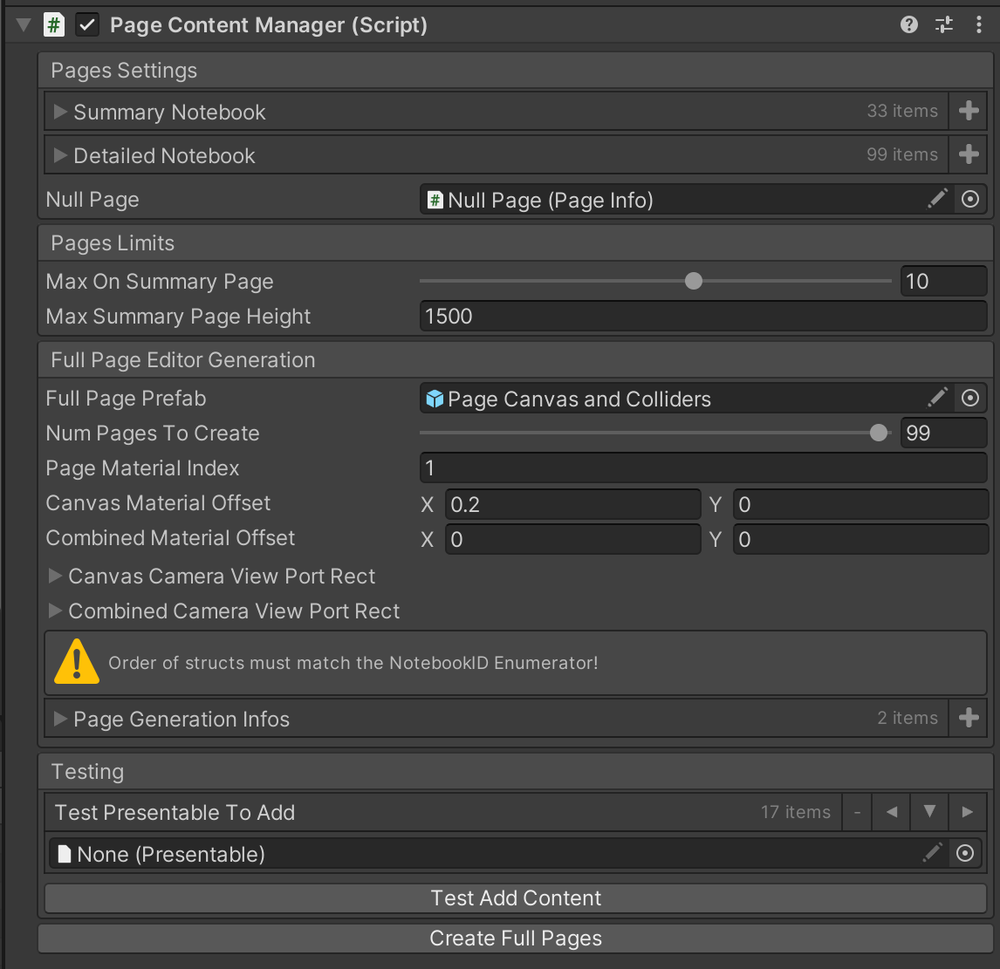
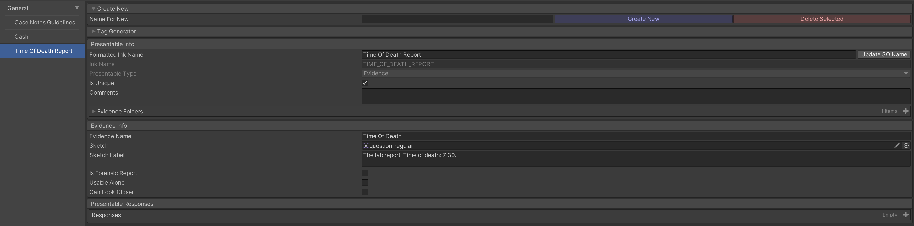
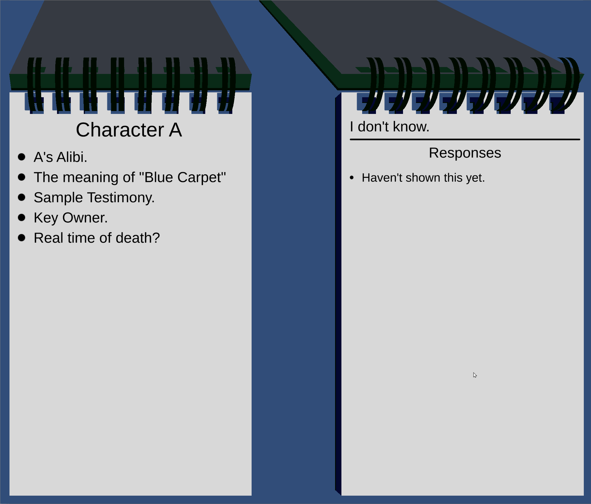

*The features shown below are part of the [Detective Project](https://github.com/jspro123/Demo-Detective-All), which is currently under development. As such, the demo's code/assets will remain private.*
*I am not affiliated with any of the assets linked below.*
***

## What is the Notebook?

The notebook contains all the information the player can learn throughout the game:

- Testimony from other Characters.
- Evidence.
- Characters.
- Locations.
- Books. 
- *And more...*

As such, a lot of time was spent making sure that it's easy to navigate, read, and search through.

*Still a work in progress. Excuse the visuals!*

### Assets Used

- [EndlessBook](https://support9569.wixsite.com/echo17/endlessbook) (a different model than the one provided was created and used, but the book navigation scripts remain the same).

### Features

- A dynamically created set of notebooks.
	- There are two notebooks.
		1. The Summary Notebook, where summaries of learned testimony/evidence are listed.
		2. The Detailed Notebook, that has an entire page for each "fact" learned.
	- Each notebook page is a material. Editor scripts were written to create, en masse, the Material and RenderTexture assets, as well as the page GameObject.
    
	- Entries are added to the notebooks dynamically, as the player learns them.
    
- Clickable and navigatable. 
	- Attached to a page GameObject are a camera and set of box colliders (also dynamically created). The box colliders describe which parts of the page are clickable. The camera transforms the raycast from the main camera onto the page.
	- PageUIElement components are attached to the page's UI to describe exactly what happens on MouseEnter, MouseExit, MouseClick, etc.
	- Unused pages are disabled, making the system very performant.
- Tag system.
	- Text in the notebook can be tagged for additional functionality. 
	- Tags include:
		- Hyperlinks, to jump to the referenced fact (if it's been learned).
- Other features
	- Players can bookmark pages of their choice.
	- Players can highlight facts they deem important.
